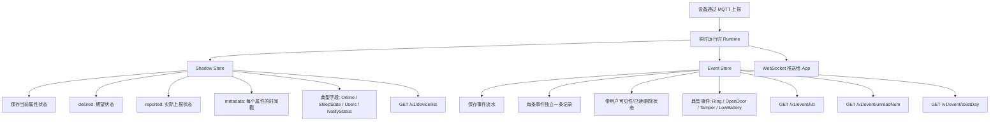
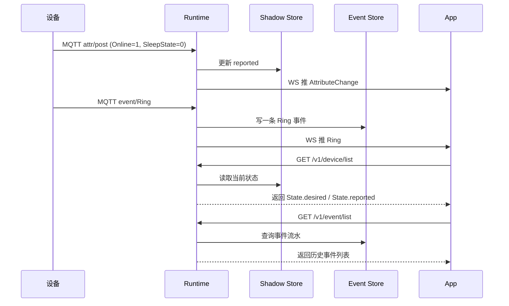

# Shadow Store 与 Event Store 说明

这份文档用于帮助开发人员快速理解实时链路里两类核心存储的职责：

- `shadow store`：保存设备当前状态
- `event store`：保存设备事件历史

最重要的区分只有一句话：

- `shadow` 解决“设备现在是什么状态”
- `event` 解决“设备发生过什么事”

---

## 1. 整体关系图

---

## 2. Shadow Store 的作用

`shadow store` 可以理解为“设备状态镜子”。

它保存的是设备当前最新状态，而不是历史流水。当前实现里，主要承载：

- `desired`：后端或 App 希望设备变成的状态
- `reported`：设备当前实际上报的状态
- `metadata`：每个属性最后一次更新时间戳
- `version`：影子版本号

典型例子：

- App 调 `SetAttribute`，先写 `desired`
- 设备通过 MQTT `attr/post` 上报属性，更新 `reported`
- `GET /v1/device/list` 返回的 `State`，从 shadow 中组装

它的核心目标是：

- 给设备提供统一的“当前状态快照”
- 让 App 重连、重开页面时能直接拿到最新状态
- 让“目标状态”和“实际上报状态”分开保存

一句话理解：

> Shadow Store 不是记日志，而是记设备的当前快照。

---

## 3. Event Store 的作用

`event store` 可以理解为“设备事件流水”。

它保存的是一条条发生过的事件，每条事件独立存在，不会像 shadow 那样被新状态覆盖。

典型例子：

- `Ring`
- `OpenDoor`
- `Tamper`
- `LowBattery`
- `UpgradeResult`

一条事件通常包含：

- `uuid`
- `type`
- `time`
- `device_time`
- `payload`
- `thumbnail`
- `belong_to`

其中 `belong_to` 记录：

- 哪些用户能看到这条事件
- 哪些用户已读
- 哪些用户已删除

它主要服务这些接口：

- `GET /v1/event/list`
- `GET /v1/event/unreadNum`
- `POST /v1/event/read`
- `DELETE /v1/event/delete`
- `GET /v1/event/existDay`

一句话理解：

> Event Store 不是记当前值，而是记设备的事件历史。

---

## 4. 为什么不能混成一个存储

因为“状态”和“事件”本质上是两类完全不同的数据。

### 4.1 `Online`

这是当前状态。

- 我们只关心设备现在在线还是离线
- 新状态会覆盖旧状态
- 适合放在 `shadow store`

### 4.2 `Ring`

这是事件流水。

- 今天可能触发多次
- 每次都要保留
- 适合放在 `event store`

如果把 `Ring` 也塞进 shadow，就只能保留最后一次结果，历史会丢失。  
如果把 `Online` 也当事件存，就不方便直接回答“设备现在是否在线”。

---

## 5. 一个完整流转例子

---

## 6. 对开发的实际意义

当你在代码里判断一段数据该写哪里时，可以直接套这两个问题：

1. 这是“当前状态”还是“历史事件”？
2. 新值来了以后，是应该覆盖旧值，还是应该新增一条？

判断规则：

- 应该覆盖旧值：放 `shadow store`
- 应该保留历史：放 `event store`

---

## 7. 当前项目里的落点

当前仓库里，这两个概念主要对应：

- `internal/realtime/shadow/`
- `internal/realtime/eventstore/`
- `internal/realtime/runtime.go`

其中：

- `runtime.go` 负责决定 MQTT 上报是更新 shadow，还是写 event，还是两者都不写只推前端
- `shadow` 目录负责设备影子读写
- `eventstore` 目录负责事件查询、未读、已读、删除、按天统计

---

## 8. 一句话总结

- `shadow store`：设备状态快照中心
- `event store`：设备事件历史中心
